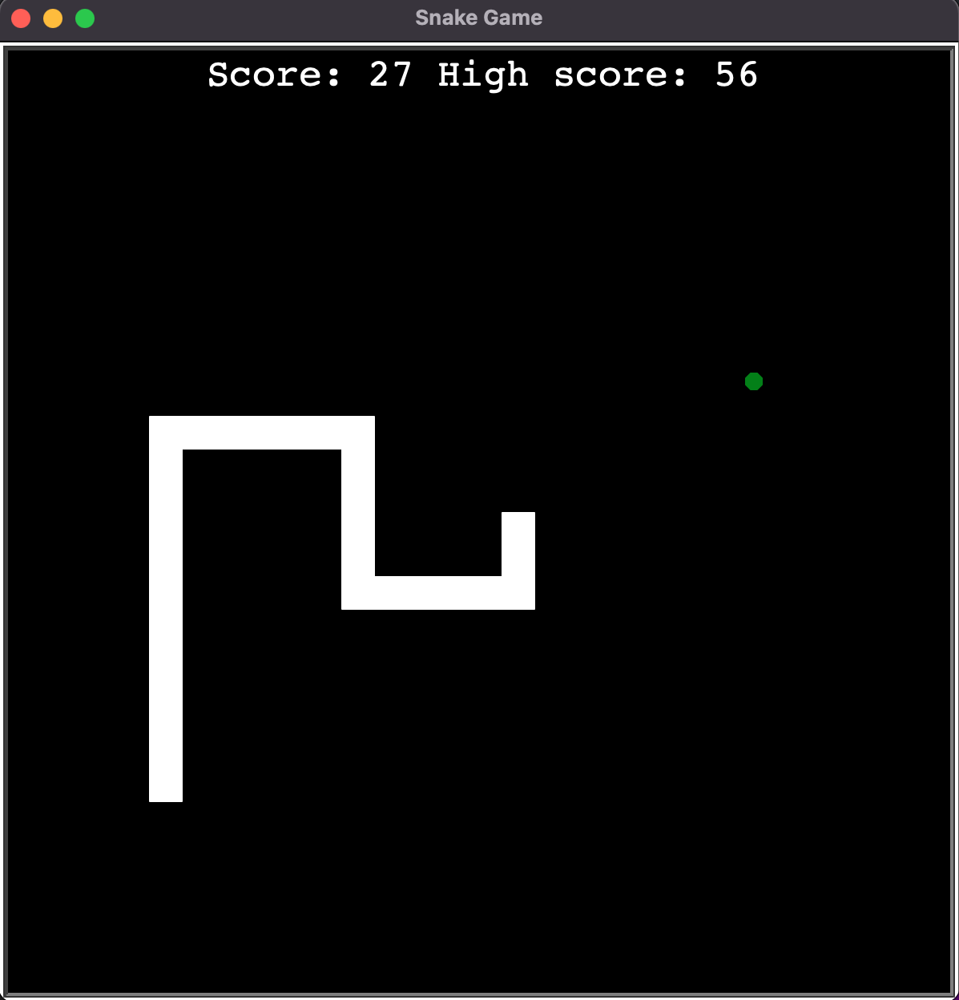

# SnakeGame

# Turtle Invaders

Remake of the famous Snake game.

<p align="center">

 </p>


<h3> Project setup </h3>

Create the virtual environment and install the requirements on mac:
<br/>

```
python3 -m venv venv
source venv/bin/activate
python install -r requirements.txt
```

After that run the following script for run the code:
<br/>

```
python main.py
```

and enjoy.
<br/>
<h3> Technologies used </h3>

Python, Turtle
